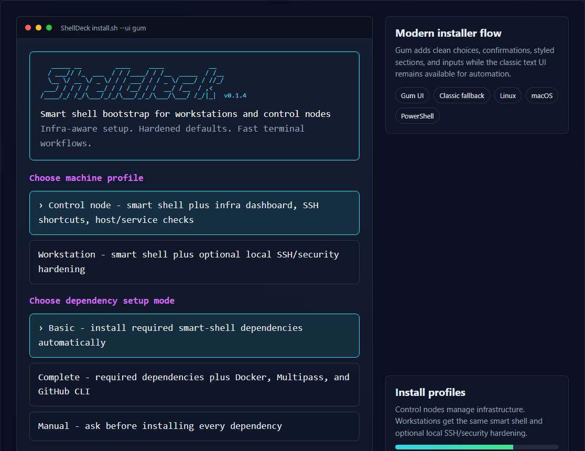
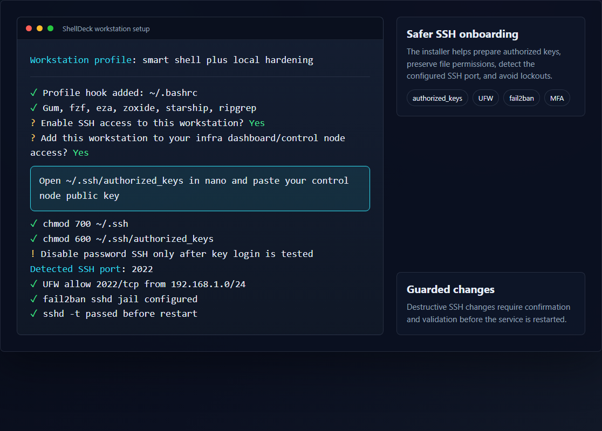
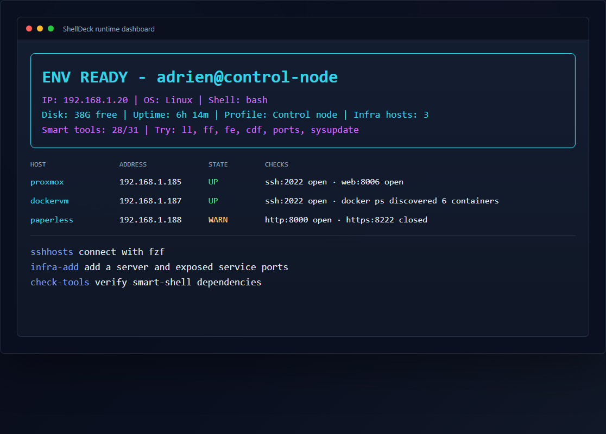

# ShellDeck

Cross-platform smart shell bootstrap for fresh VMs, workstations, and homelab control nodes.

ShellDeck installs a profile runtime that upgrades your terminal startup, keeps personal aliases/functions in one place, and can optionally turn a control node into an infra dashboard for SSH hosts such as Proxmox, Docker VMs, and app servers.

## Screenshots







## One-command install

### Windows PowerShell

```powershell
irm https://raw.githubusercontent.com/adrienclaire/ShellDeck/v0.1.4/install.ps1 -OutFile install.ps1
.\install.ps1
```

### Linux

```bash
curl -fsSLO https://raw.githubusercontent.com/adrienclaire/ShellDeck/v0.1.4/install.sh
bash install.sh
```

### macOS

```bash
curl -fsSLO https://raw.githubusercontent.com/adrienclaire/ShellDeck/v0.1.4/install.sh
bash install.sh
```

To verify checksums first:

```bash
curl -fsSLO https://raw.githubusercontent.com/adrienclaire/ShellDeck/v0.1.4/install.sh
curl -fsSLO https://raw.githubusercontent.com/adrienclaire/ShellDeck/v0.1.4/checksums.txt
sha256sum -c --ignore-missing checksums.txt
bash install.sh
```

The Linux/macOS installer also has explicit local wrappers:

```bash
bash install-linux.sh
bash install-macos.sh
```

## What It Does

- Installs the shell runtime into `~/.shell-alias-tools`.
- Hooks the runtime into your PowerShell, Bash, or Zsh profile.
- Lets you choose a machine profile first: Control node for infra management, or Workstation for smart shell only.
- Prints an `ENV READY` dashboard on shell startup with user, host, IP, disk, uptime, profile, and smart-tool status.
- Turns Bash into a smarter daily shell with clean shared history, Bash completion, fzf key bindings, a Starship prompt, modern file listing, pretty file reading, smart directory jumping, fuzzy file picking, archive extraction, port inspection, and safe fallbacks.
- Installs or offers common CLI dependencies: `git`, `ssh`, `curl`, `wget`, `gum`, `fzf`, `bash-completion`, `bat`, `eza`, `zoxide`, `starship`, `ripgrep`, `fd`, `jq`, `yq`, `nc`, `tree`, `unzip`, `zip`, `rsync`, `tmux`, `btop`, `htop`, `duf`, `neovim`, `gh`, `docker`, and `multipass` where supported.
- On Linux installs, adds VM hardening helpers: `ufw` and `fail2ban`, with optional guided configuration.
- Lets you choose Basic, Complete, or Manual dependency setup at install time.
- In Control node profile, asks whether to enable inbound SSH, configure Linux security, add SSH hosts, store infra hosts, and track one host with many exposed service ports.
- In Workstation profile, skips infra dashboard commands but can still configure inbound SSH, authorized keys, UFW, fail2ban, and MFA for the local workstation.

## Main Commands

Control node commands:

```text
init          Infra dashboard and live host checks
shellsetup    Interactive first-run setup
infra-add     Add a server to infra config
infra-edit    Modify an existing server
infra-list    List configured servers
sshhosts      Pick an SSH host and connect
```

Available in both profiles:

```text
check-tools   Check local CLI dependencies
shelluninstall Remove profile hook and optionally delete local data
myhelp        Show all commands
```

Alias helpers:

```text
ll/la/l/lt    Modern directory listing with eza when available
cat/catp      Pretty file reading with bat or batcat when available
z/zi          Smart directory jumping with zoxide when available
cdf           Fuzzy cd into a directory with fzf
ff            Fuzzy find a file with preview
fe            Fuzzy find a file and open it in editor
mkcd          Create a directory and cd into it
please        Re-run the previous command with sudo (opt-in)
extract       Extract common archive formats
serve         Start a quick HTTP file server
ports         Show listening TCP/UDP ports
dps/dcu/dcd/dcl Docker ps, compose up/down/logs
duh           Show first-level disk usage sorted by size
pathlist      Print PATH one entry per line
sysupdate     Update the VM with the detected package manager
aa            Save the previous command as an alias/function
laa           List aliases on Bash/Zsh
rma           Remove alias on Bash/Zsh
lf            List saved PowerShell functions
ep            Edit PowerShell profile
reloadp       Reload the profile runtime
```

## Smart Bash Layer

On interactive Bash shells, the runtime applies a Bash-compatible quality-of-life layer:

```bash
HISTSIZE=100000
HISTFILESIZE=200000
HISTCONTROL=ignoreboth:erasedups
shopt -s histappend cmdhist checkwinsize
PROMPT_COMMAND='history -a; history -c; history -r'
```

It sources `bash-completion` when installed, loads fzf key bindings and completion from common Linux and Homebrew paths, initializes zoxide, activates Starship when installed, and falls back to a compact colored prompt with Git branch awareness when Starship is unavailable. Existing custom aliases saved with `aa` still win.

The target VM tool belt is intentionally broad but still Bash-compatible: file navigation (`eza`, `zoxide`, `fd`, `ripgrep`, `fzf`), prompt/theme (`starship`), file reading/editing (`bat`, `neovim`), JSON/YAML (`jq`, `yq`), ops visibility (`btop`, `htop`, `duf`, `ports`), remote/dev basics (`ssh`, `rsync`, `tmux`, `gh`), and infra extras (`docker`, `multipass`) when you accept them.

The Windows PowerShell installer mirrors the same profile choice and smart tool checklist through `winget` where a reliable native package exists. Control node defaults are generic: `server1`, `admin`, port `22`, and an IPv4 prompt example like `192.168.1.X`.

## Install Options

Windows:

```powershell
.\install.ps1 -Yes
.\install.ps1 -DryRun
.\install.ps1 -Ui auto
.\install.ps1 -GumUi
.\install.ps1 -ClassicUi
.\install.ps1 -MachineProfile control
.\install.ps1 -MachineProfile workstation
.\install.ps1 -Mode basic
.\install.ps1 -Mode complete
.\install.ps1 -Mode manual
.\install.ps1 -SkipDeps
.\install.ps1 -SkipInfra
```

Linux/macOS:

```bash
bash install.sh --yes
bash install.sh --dry-run
bash install.sh --ui auto
bash install.sh --gum-ui
bash install.sh --classic-ui
bash install.sh --profile control
bash install.sh --profile workstation
bash install.sh --mode basic
bash install.sh --mode complete
bash install.sh --mode manual
bash install.sh --skip-deps
bash install.sh --skip-infra
```

Setup modes:

```text
Control node  Smart shell plus infra dashboard, SSH shortcuts, host/service checks.
Workstation   Smart shell plus optional local SSH/security hardening. No infra dashboard commands.
```

Dependency modes:

```text
Basic    Install required smart-shell dependencies automatically.
Complete Install required dependencies plus GitHub CLI, Docker, and Multipass.
Manual   Ask before installing each dependency.
```

On apt-based Linux systems, the installer runs `apt-get update`, counts available upgrades, and asks before running `apt-get upgrade -y`.

`--dry-run` / `-DryRun` previews file writes, package installs, profile hooks, SSH setup, and Linux security actions without changing the system.

Installer UI:

```text
auto      Use Gum when available and offer to install it interactively.
gum       Prefer Gum and try to install it when missing.
classic   Use portable text prompts only.
```

The Gum UI is optional. When available, the installer uses styled sections plus interactive choices, confirmations, and inputs. If Gum is missing, ShellDeck can install it first. On apt-based Linux systems where `gum` is not in the default repositories, the installer adds Charmbracelet's official apt repository and retries. A downloaded installer re-launches itself with Gum after installation; `curl | bash` cannot reliably re-exec the consumed stream, so it refreshes PATH and continues with Gum when available. If Gum is unavailable or the script is non-interactive, ShellDeck falls back to classic prompts.

## Safety Defaults

- `please` is disabled by default because it re-runs shell history with elevated privileges. Enable it with `SHELL_TOOLS_ENABLE_PLEASE=1`.
- PowerShell `add-func` is disabled by default because it stores executable function bodies. Enable it with `SHELL_TOOLS_ENABLE_CUSTOM_FUNCTIONS=1`.
- The Starship remote installer fallback is opt-in. Set `SHELL_TOOLS_ALLOW_REMOTE_INSTALLERS=1` or answer yes when prompted.
- Tagged install URLs are recommended for production. `main` is for development.

## Linux Security Setup

After dependency setup on Linux installs, the installer can guide:

- UFW firewall defaults: deny incoming, allow outgoing.
- SSH inbound allow rule, with port `22` as the default or your custom SSH port.
- Extra inbound rules by port, protocol (`tcp`, `udp`, or `both`), and source (`*`, IPv4, CIDR, or `192.168.1.*`).
- ICMP echo-request rules for ping, including source-limited LAN rules.
- fail2ban SSH jail settings: port, retry count, find window, and ban time.
- Optional TOTP MFA through PAM for SSH, local console login, or both.

When you run the installer over SSH, UFW enablement defaults to no after warning you about lockout risk. MFA setup uses `google-authenticator` where available and validates `sshd -t` before reloading SSH. It keeps `nullok` by default during rollout so an unenrolled user is not locked out unless you explicitly choose to require MFA immediately. Passkey/PAM U2F setup is not automated yet because it needs per-user hardware key enrollment and mapping.

In Workstation profile, SSH hardening is local to the workstation. The installer can enable SSH, prepare `~/.ssh/authorized_keys`, open it in `nano` so you can paste the control node public key, fix permissions, recommend disabling password SSH login only after key login is tested, optionally open `/etc/ssh/sshd_config`, detect the configured SSH port, add that port to UFW, validate `sshd -t`, and restart SSH only after explicit confirmation.

## Infra Config

Infra config is enabled only in the Control node profile.

The host setup flow is:

```text
Host alias (default: server1)
Host IPv4 (example: 192.168.1.X)
SSH access? yes/no
  SSH user (default: admin)
  SSH port
  Add to ~/.ssh/config? yes/no
Docker on this host? yes/no
Service endpoint? yes/no
  Protocol: http or https
  Port: 8000
  Port: 8222
```

Hosts are stored as CSV:

```csv
Name,HostName,SshEnabled,User,Port,InSshConfig,Docker,Services
server1,192.168.1.187,true,admin,22,true,true,http://192.168.1.187:8000;https://192.168.1.187:8222
```

If Docker is enabled and the host has SSH access, `init` will run `docker ps` over SSH and print exposed container URLs. It uses the SSH config alias when available, otherwise it connects with `ssh -p <port> <user>@<ip>`.

When adding a service to a host, enter the protocol and the port. For host `192.168.1.187`, protocol `https` with port `8222` saves `https://192.168.1.187:8222`.

## macOS Notes

Yes, `fzf` works on macOS. The installer treats it as a required dependency for the best experience and can install it with Homebrew. ShellDeck uses `fzf` directly for `sshhosts` and `infra-edit`.

Docker and Multipass are heavier desktop tools on macOS. Complete mode installs them; Manual mode asks before each one; Basic mode skips them.

## Production Readiness

- CI parses Bash on Ubuntu/macOS and PowerShell on Ubuntu/Windows.
- CI runs high-confidence secret-pattern checks.
- ShellCheck runs as an advisory job while the scripts continue to mature.
- Release installs should use tagged URLs and checksum verification.
- `SECURITY.md` documents risky features, Linux hardening behavior, and vulnerability reporting.

## License

ShellDeck is source-available under the Apache License 2.0 with an additional non-commercial use restriction and the Commons Clause License Condition v1.0.

This project is free for personal and educational use only. Commercial use, resale, sublicensing, paid hosting, offering ShellDeck as a service, or redistribution for profit requires explicit written authorization.

See the `LICENSE` file for details.

## Files

```text
VERSION            Current release version
CHANGELOG.md       Release notes
LICENSE            Source-available license terms
SECURITY.md        Security policy and safe install guidance
checksums.txt      SHA256 checksums for release artifacts
install.ps1        Windows installer
install.sh         Linux/macOS installer
install-linux.sh   Linux wrapper
install-macos.sh   macOS wrapper
alias-tools.ps1    PowerShell runtime
shell-tools.sh     Bash/Zsh runtime
alias-tools.md     Original Bash alias-tool example
docs/screenshots   Browser-rendered README screenshots
```
