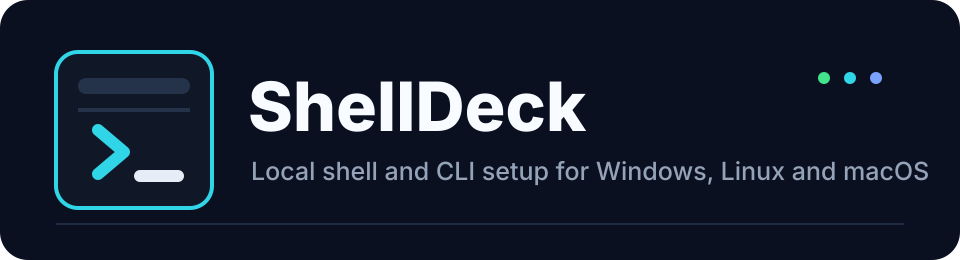
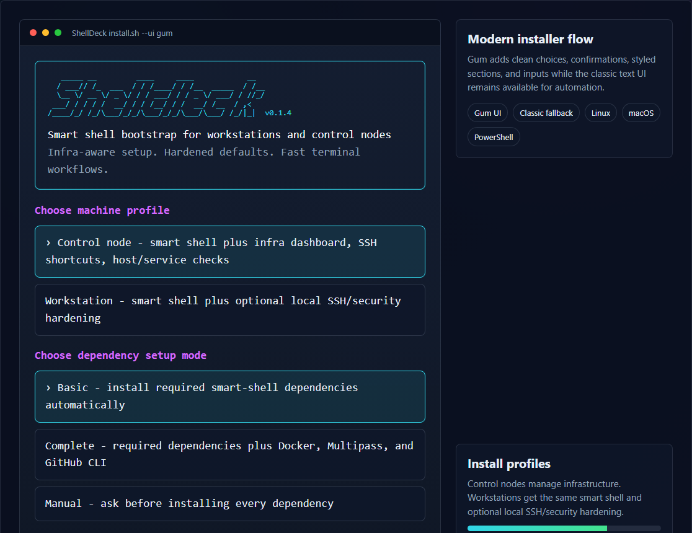
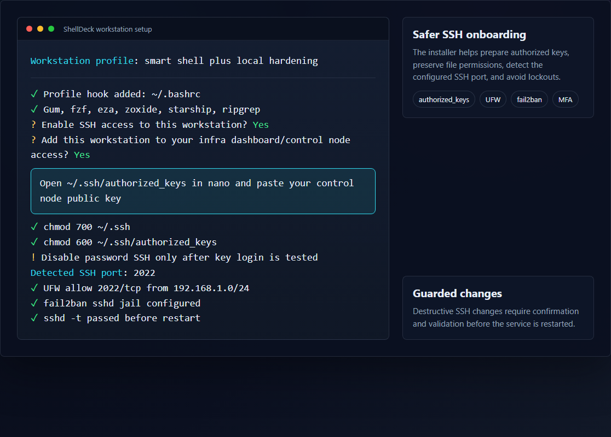
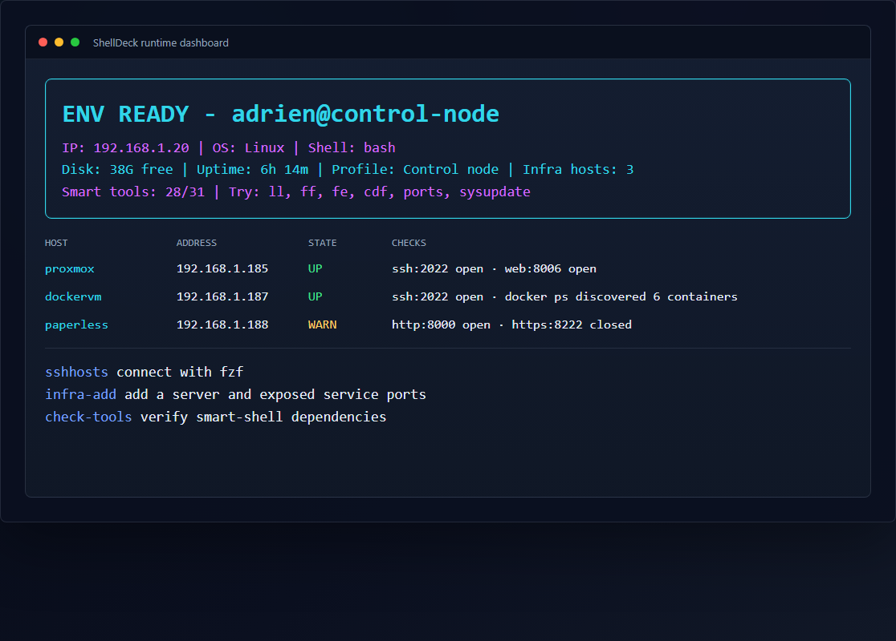

<p align="center">
  
</p>

# ShellDeck

ShellDeck is an interactive local bootstrapper for Windows, Linux, and macOS. It installs or checks CLI tools, adds a PowerShell/Bash/Zsh runtime through a marked profile hook, and optionally configures SSH access and local infra helpers.

**Inspect first:** clone this repository, read the installer, then run the [dry-run commands below](#safety--inspectability). **Remove later:** `shelluninstall` removes the hook and keeps user data unless you explicitly choose deletion. It does not undo installed packages or SSH/firewall/PAM changes.

## What ShellDeck is, and what it is not

- A bootstrap layer for a fresh machine: tool installation, shell integration, workstation/control-node selection, and optional SSH host/service helpers and startup dashboard.
- Not a replacement for dotfiles, chezmoi, Ansible, cloud-init, or enterprise configuration management. If you only need to sync a PowerShell profile or `.bashrc`, a dotfiles repository is enough.
- Opinionated defaults, kept in the runtime rather than mixed into user files. Existing aliases/functions take precedence; the separate user customization file is loaded last. ShellDeck does not replace your profile with its own.
- Runtime updates preserve user aliases/functions, infra hosts, saved machine profile, SSH configuration/keys, and local data. The runtime is backed up before replacement. Reinstalling keeps configuration keys and the saved machine profile unless you explicitly choose another profile.

## Why not just dotfiles?

Dotfiles work well for syncing personal configuration. ShellDeck handles the local setup around those files: discovering missing tools, installing accepted dependencies, loading a runtime, and offering SSH/infra setup. You can use both. Keep your dotfiles in your existing workflow; put ShellDeck-specific overrides in `aliases.ps1` or `aliases.sh`, or define them in your own profile. Updates do not overwrite these files.

## ShellDeck vs dotfiles / chezmoi / Ansible

| Tool | Primary purpose | Relationship to ShellDeck |
| --- | --- | --- |
| dotfiles repository | Sync personal configuration | Enough for config-only needs; can coexist with ShellDeck |
| chezmoi | Dotfiles with templates and secrets | Manages personal config; ShellDeck offers local interactive bootstrap |
| Ansible | Infrastructure configuration management | Suited to repeatable fleet management; ShellDeck runs locally |
| ShellDeck | Interactive cross-platform bootstrap, shell runtime, CLI tools, SSH/infra helpers | Optional setup layer, not a dotfiles or fleet manager |

## Safety / inspectability

From a local clone, preview a deterministic workstation setup without downloading a runtime, installing packages, writing files, or loading the runtime:

```powershell
.\install.ps1 -DryRun -Yes -ClassicUi -MachineProfile workstation -Mode basic
```

```bash
bash install.sh --dry-run --yes --classic-ui --profile workstation --mode basic
```

Use `control` to preview control-node setup. Without `--yes` / `-Yes`, dry-run remains interactive and previews only selected branches. It does not validate real installations or connectivity. macOS uses the same Bash installer; `--os macos` previews package mappings on Linux but is not a native macOS test.

| Surface | Changes | Preservation / limits |
| --- | --- | --- |
| Runtime | `~/.shell-alias-tools/shell-tools.ps1` or `shell-tools.sh` | Timestamped runtime backup on update/reinstall |
| User code | Creates `aliases.ps1` / `aliases.sh` if absent, loads it last | Existing contents and custom functions never overwritten on update/reinstall |
| Settings/data | `config`, control-node `infra-hosts.csv`, PowerShell dashboard cache | Updates retain them; reinstall changes only the selected machine-profile key |
| Startup file | Appends a marked hook to `$PROFILE` on Windows; `.zshrc` and existing `.bashrc` on macOS; `.bashrc` or `.zshrc` on Linux | Keeps content outside the hook; detects an existing hook |
| PATH | Refreshes the installer process search path | Keeps search order; no ShellDeck persistent User/Machine PATH writes or profile PATH lines |
| Packages | Basic installs the default tool set; Complete adds `gh`, Docker, Multipass; Manual asks per tool | Detects existing tools; package installers may have their own persistent PATH/system effects |
| SSH/security | Optional SSH setup; Linux UFW, fail2ban, PAM/TOTP configuration after confirmation | Runtime updates leave SSH/security files alone; uninstall does not revert these changes |

Tool installation is best-effort: package availability and mappings differ across operating systems. Unsupported or failed installs are reported; use `check-tools` to see what is actually available. Older infra CSV schemas may be migrated when the runtime loads; a backup keeps the original file.

The directory can be changed with `SHELL_ALIAS_TOOLS_HOME` (also `-InstallDir` on Windows). Keep that environment setting when loading a runtime installed in a custom directory.

**Scope:** Workstation skips infra host management. Control node enables `init`, `infra-add`, `infra-edit`, and `sshhosts`. Windows Workstation skips inbound SSH setup; Linux/macOS can offer it. Linux also offers firewall/fail2ban/MFA. `--skip-deps` / `-SkipDeps` skips dependencies and local SSH/security setup; `--skip-infra` / `-SkipInfra` skips host onboarding. Gum is independently offered for the installer UI; use `--classic-ui` / `-ClassicUi` to avoid that bootstrap.

**Session behavior:** the runtime can configure history/completion, fzf bindings, and the prompt. Set `SHELL_TOOLS_NO_PROMPT=1` before loading to keep your prompt. PowerShell also preserves a custom `prompt` function already present; use the opt-out for Bash/Zsh prompt customization. The dashboard is optional: PowerShell has `shelldeckinfo-disabled`; `SHELL_TOOLS_NO_DASHBOARD=1` suppresses it on either runtime. Bash/Zsh enhancements and startup output run only in interactive shells; PowerShell automation should suppress the banner or use `-NoProfile`.

**Sensitive helpers:** `please` (sudo from history) and PowerShell `add-func` (persist executable code) are disabled by default. Starship's remote installer fallback requires opt-in. Customization files are executable user code, not a sandbox.

**Update:** `shelldeck-update` downloads, syntax-checks, backs up, and replaces only the runtime. It defaults to `main`; set `SHELLDECK_UPDATE_REF` to a reviewed tag. Syntax validation does not establish trust in downloaded code. See [Updating](#updating).

**Uninstall:** `shelluninstall` removes the hook after confirmation. Answer **no** to deleting local data to keep aliases, settings, and infra hosts, then restart the shell. Packages, SSH config/keys, firewall rules, and PAM changes remain; undo them separately if enabled. Test SSH/firewall/MFA in a disposable VM with recovery access; see [SECURITY.md](SECURITY.md).

## User customization and precedence

Do not edit the shipped runtime to keep a change across updates. Edit `~/.shell-alias-tools/aliases.ps1` or `aliases.sh`, or keep your commands in your own dotfiles. Definitions already in the session survive runtime loads/reloads; the separate user file runs last and overrides runtime defaults. Normal alias/function precedence still applies: remove an existing alias explicitly if you want to replace it with a function of the same name. Internal `_shell_tools_*` / `_alias_tools_*` helpers and `ShellDeck*` state variables are reserved implementation details.

PowerShell example in `aliases.ps1`:

```powershell
function ll { Get-ChildItem -Force }
Set-Alias gs Get-Location
```

Bash/Zsh example in `aliases.sh`:

```bash
alias ll='ls -la'
gs() { git status --short; }
```

PowerShell aliases retain normal precedence over functions, including Windows' built-in `cat` for `Get-Content`. Use `catp` for the bat helper, or explicitly override `cat` in your user file. ShellDeck does not remove your aliases to force its defaults into use.

## PATH handling

`Refresh-InstallerSessionPath` (PowerShell) reads Process, User, and Machine PATH, keeps process search order, and appends existing missing directories. It uses `System.Environment` with target `Process` only. `refresh_installer_session_path` (Bash) appends existing local-bin, Homebrew, and snap directories for tool discovery. Neither writes persistent PATH or prepends these directories; repeated refreshes avoid duplicate additions. Dry-run leaves even the process PATH unchanged.

These refreshes let the installer find newly installed commands; they do not configure future terminals. Restart after installation to pick up the OS/package-manager environment. Package managers such as winget or the Homebrew installer can make their own environment changes, separately from ShellDeck's session refresh.

## Screenshots







## Install

The download commands below use the `v0.2.6` release. Local installs use the bundled runtime.

### Windows PowerShell

```powershell
irm https://raw.githubusercontent.com/adrienclaire/ShellDeck/v0.2.6/install.ps1 -OutFile install.ps1
.\install.ps1
```

### Linux

```bash
curl -fsSLO https://raw.githubusercontent.com/adrienclaire/ShellDeck/v0.2.6/install.sh
bash install.sh
```

### macOS

```bash
curl -fsSLO https://raw.githubusercontent.com/adrienclaire/ShellDeck/v0.2.6/install.sh
bash install.sh
```

To verify checksums first:

```bash
curl -fsSLO https://raw.githubusercontent.com/adrienclaire/ShellDeck/v0.2.6/install.sh
curl -fsSLO https://raw.githubusercontent.com/adrienclaire/ShellDeck/v0.2.6/checksums.txt
sha256sum -c --ignore-missing checksums.txt
bash install.sh
```

The Linux/macOS installer also has explicit local wrappers:

```bash
bash install-linux.sh
bash install-macos.sh
```

## What It Does

- Installs the shell runtime into `~/.shell-alias-tools`.
- Hooks the runtime into your PowerShell, Bash, or Zsh profile.
- Lets you choose a machine profile first: Control node for infra management, or Workstation for smart shell only.
- Can print a startup dashboard with user, host, IP, disk, uptime, profile, and CLI-tool status; it can be disabled.
- Turns Bash into a smarter daily shell with clean shared history, Bash completion, fzf key bindings, a Starship prompt, modern file listing, pretty file reading, smart directory jumping, fuzzy file picking, archive extraction, port inspection, and safe fallbacks.
- Installs or offers common CLI dependencies: `git`, `ssh`, `curl`, `wget`, `coreutils`, `gum`, `fzf`, `bash-completion`, `bat`, `eza`, `zoxide`, `starship`, `ripgrep`, `fd`, `jq`, `yq`, `nc`, `tree`, `unzip`, `zip`, `rsync`, `tmux`, `btop`, `htop`, `duf`, `neovim`, `gh`, `docker`, and `multipass` where supported.
- On Linux installs, adds VM hardening helpers: `ufw` and `fail2ban`, with optional guided configuration.
- Lets you choose Basic, Complete, or Manual dependency setup at install time.
- In Control node profile, asks whether to enable inbound SSH, configure Linux security, add SSH hosts, store infra hosts, and track one host with many exposed service ports.
- In Workstation profile, skips infra dashboard commands but can still configure inbound SSH, authorized keys, UFW, fail2ban, and MFA for the local workstation.

## Main Commands

Control node commands:

```text
init          Infra dashboard and live host checks
shellsetup    Interactive first-run setup
infra-add     Add a server to infra config
infra-edit    Modify an existing server
infra-list    List configured servers
sshhosts      Pick an SSH host and connect
```

Available in both profiles:

```text
check-tools   Check local CLI dependencies
shelldeckinfo-disabled Disable automatic PowerShell startup banner
shelldeckinfo-enabled Enable automatic PowerShell startup banner
shelldeckinfo-status Show startup banner setting
shelldeck-refresh Refresh the daily PowerShell dashboard cache
shelldeck-update Update ShellDeck while preserving aliases and infra data
shelluninstall Remove profile hook and optionally delete local data
myhelp        Show all commands
```

## PowerShell Startup Banner

ShellDeck can print a compact environment banner when PowerShell loads your profile. For long-running workstation use, automation, or AI agents that launch PowerShell often, you can disable that automatic banner while keeping all commands available:

```powershell
shelldeckinfo-disabled
```

Re-enable it later with:

```powershell
shelldeckinfo-enabled
```

Check the current setting with:

```powershell
shelldeckinfo-status
```

The setting is persisted in `~/.shell-alias-tools/config`. For a single process, `SHELL_TOOLS_NO_DASHBOARD=1` still suppresses the banner without changing the saved setting.

## Updating

You do not need to uninstall ShellDeck before updating. Run:

```text
shelldeck-update
```

The updater downloads and validates the runtime from `main`, backs up the installed runtime, replaces only that runtime file, and reloads it. It preserves:

- infra hosts and services
- custom aliases and functions
- machine profile configuration
- dashboard cache
- SSH config and keys

To update from a specific release tag or branch:

```bash
SHELLDECK_UPDATE_REF=v0.2.6 shelldeck-update
```

```powershell
$env:SHELLDECK_UPDATE_REF = "v0.2.6"
shelldeck-update
```

Rerunning the installer also preserves existing aliases and infra data. During uninstall, answer no when asked whether to delete the ShellDeck data directory if you intend to reinstall later.

Alias helpers:

Names already used by your shell or dotfiles retain their normal precedence over these defaults.

```text
ll/la/l/lt    Modern directory listing with eza when available
cat/catp      Pretty file reading with bat or batcat when available
z/zi          Smart directory jumping with zoxide when available
cdf           Fuzzy cd into a directory with fzf
ff            Fuzzy find a file with preview
fe            Fuzzy find a file and open it in editor
mkcd          Create a directory and cd into it
please        Re-run the previous command with sudo (opt-in)
extract       Extract common archive formats
serve         Start a quick HTTP file server
ports         Show listening TCP/UDP ports
dps/dcu/dcd/dcl Docker ps, compose up/down/logs
duh           Show first-level disk usage sorted by size
pathlist      Print PATH one entry per line
sysupdate     Update the VM with the detected package manager
aa            Save the previous command as an alias/function
laa           List aliases on Bash/Zsh
rma           Remove alias on Bash/Zsh
lf            List saved PowerShell functions
ep            Edit PowerShell profile
reloadp       Reload the profile runtime
```

## Smart Bash Layer

On interactive Bash shells, the runtime applies a Bash-compatible quality-of-life layer:

```bash
HISTSIZE=100000
HISTFILESIZE=200000
HISTCONTROL=ignoreboth:erasedups
shopt -s histappend cmdhist checkwinsize
PROMPT_COMMAND='history -a; history -c; history -r'
```

It sources `bash-completion` when installed, loads fzf key bindings and completion from common Linux and Homebrew paths, initializes zoxide, activates Starship when installed, and falls back to a compact colored prompt with Git branch awareness when Starship is unavailable. Custom aliases/functions and the separate user file take precedence. Set `SHELL_TOOLS_NO_PROMPT=1` to retain your Bash/Zsh prompt.

The target VM tool belt is intentionally broad but still Bash-compatible: file navigation (`eza`, `zoxide`, `fd`, `ripgrep`, `fzf`), prompt/theme (`starship`), file reading/editing (`bat`, `neovim`), JSON/YAML (`jq`, `yq`), ops visibility (`btop`, `htop`, `duf`, `ports`), remote/dev basics (`ssh`, `rsync`, `tmux`, `gh`), and infra extras (`docker`, `multipass`) when you accept them.

The Windows PowerShell installer mirrors the same profile choice and smart tool checklist through `winget` where a reliable native package exists. Control node defaults are generic: `server1`, `admin`, port `22`, and an IPv4 prompt example like `192.168.1.X`.

## Install Options

Windows:

```powershell
.\install.ps1 -Yes
.\install.ps1 -DryRun
.\install.ps1 -Ui auto
.\install.ps1 -GumUi
.\install.ps1 -ClassicUi
.\install.ps1 -MachineProfile control
.\install.ps1 -MachineProfile workstation
.\install.ps1 -Mode basic
.\install.ps1 -Mode complete
.\install.ps1 -Mode manual
.\install.ps1 -SkipDeps
.\install.ps1 -SkipInfra
```

Linux/macOS:

```bash
bash install.sh --yes
bash install.sh --dry-run
bash install.sh --ui auto
bash install.sh --gum-ui
bash install.sh --classic-ui
bash install.sh --profile control
bash install.sh --profile workstation
bash install.sh --mode basic
bash install.sh --mode complete
bash install.sh --mode manual
bash install.sh --skip-deps
bash install.sh --skip-infra
```

Setup modes:

```text
Control node  Smart shell plus infra dashboard, SSH shortcuts, host/service checks.
Workstation   Smart shell plus optional local SSH/security hardening. No infra dashboard commands.
```

Dependency modes:

```text
Basic    Install required smart-shell dependencies automatically.
Complete Install required dependencies plus GitHub CLI, Docker, and Multipass.
Manual   Ask before installing each dependency.
```

On apt-based Linux systems, the installer runs `apt-get update`, counts available upgrades, and asks before running `apt-get upgrade -y`.

`--dry-run` / `-DryRun` previews file writes, package installs, profile hooks, SSH setup, and Linux security actions without changing the system.

Installer UI:

```text
auto      Use Gum when available and offer to install it interactively.
gum       Prefer Gum and try to install it when missing.
classic   Use portable text prompts only.
```

The Gum UI is optional. When available, the installer uses styled sections plus interactive choices, confirmations, and inputs. If Gum is missing, ShellDeck can install it first. On apt-based Linux systems where `gum` is not in the default repositories, the installer adds Charmbracelet's official apt repository and retries. A downloaded installer re-launches itself with Gum after installation; `curl | bash` cannot reliably re-exec the consumed stream, so it refreshes PATH and continues with Gum when available. If Gum is unavailable or the script is non-interactive, ShellDeck falls back to classic prompts.

## Safety Defaults

- `please` is disabled by default because it re-runs shell history with elevated privileges. Enable it with `SHELL_TOOLS_ENABLE_PLEASE=1`.
- PowerShell `add-func` is disabled by default because it stores executable function bodies. Enable it with `SHELL_TOOLS_ENABLE_CUSTOM_FUNCTIONS=1`.
- The Starship remote installer fallback is opt-in. Set `SHELL_TOOLS_ALLOW_REMOTE_INSTALLERS=1` or answer yes when prompted.
- Tagged install URLs are recommended for production. `main` is for development.

## Linux Security Setup

> **Production safety warning**
>
> SSH, firewall, PAM, and MFA changes can lock you out of a machine. Test ShellDeck in a lab VM before using these features in production, keep an active recovery session open, and take a VM snapshot or backup first. You are responsible for validating the generated configuration for your environment; this project cannot be responsible for lockouts, broken access, firewall mistakes, or production outages caused by local configuration choices.

After dependency setup on Linux installs, the installer can guide:

- UFW firewall defaults: deny incoming, allow outgoing.
- SSH inbound allow rule, with port `22` as the default or your custom SSH port.
- Extra inbound rules by port, protocol (`tcp`, `udp`, or `both`), and source (`*`, IPv4, CIDR, or `192.168.1.*`).
- ICMP echo-request rules for ping, including source-limited LAN rules.
- fail2ban SSH jail settings: port, retry count, find window, and ban time.
- Optional TOTP MFA through PAM for SSH, local console login, or both.
- SSH MFA mode for public-key plus keyboard-interactive authentication, either globally or only for the current user through a `Match User` block.

When you run the installer over SSH, UFW enablement defaults to no after warning you about lockout risk. MFA setup uses `google-authenticator` where available, comments `@include common-auth` in `/etc/pam.d/sshd` for SSH MFA so password authentication is not requested after TOTP, and validates `sshd -t` before offering to restart SSH. It keeps `nullok` by default during rollout so an unenrolled user is not locked out unless you explicitly choose to require MFA immediately. Passkey/PAM U2F setup is not automated yet because it needs per-user hardware key enrollment and mapping.

In Workstation profile, SSH hardening is local to the workstation. The installer can enable SSH, prepare `~/.ssh/authorized_keys`, open it in `nano` so you can paste the control node public key, fix permissions, recommend disabling password SSH login only after key login is tested, optionally open `/etc/ssh/sshd_config`, detect the configured SSH port, add that port to UFW, validate `sshd -t`, and restart SSH only after explicit confirmation.

## Infra Config

Infra config is enabled only in the Control node profile.

The host setup flow is:

```text
Host alias (default: server1)
Host IPv4 (example: 192.168.1.X)
SSH access? yes/no
  SSH user (default: admin)
  SSH port
  Add to ~/.ssh/config? yes/no
Docker on this host? yes/no
Service endpoint? yes/no
  Protocol: http or https
  Port: 8000
  Port: 8222
```

Hosts are stored as CSV:

```csv
Name,HostName,SshEnabled,User,Port,InSshConfig,Docker,Services
server1,192.168.1.187,true,admin,22,true,true,http://192.168.1.187:8000;https://192.168.1.187:8222
```

If Docker is enabled and the host has SSH access, `init` will run `docker ps` over SSH and print exposed container URLs. It uses the SSH config alias when available, otherwise it connects with `ssh -p <port> <user>@<ip>`.

When adding a service to a host, enter the protocol and the port. For host `192.168.1.187`, protocol `https` with port `8222` saves `https://192.168.1.187:8222`.

## macOS Notes

Yes, `fzf` works on macOS. The installer treats it as a required dependency for the best experience and can install it with Homebrew. ShellDeck uses `fzf` directly for `sshhosts` and `infra-edit`.

Docker and Multipass are heavier desktop tools on macOS. Complete mode installs them; Manual mode asks before each one; Basic mode skips them.

## Production Readiness

- CI parses Bash on Ubuntu/macOS and PowerShell on Ubuntu/Windows.
- CI runs high-confidence secret-pattern checks.
- ShellCheck runs as an advisory job while the scripts continue to mature.
- Release installs should use tagged URLs and checksum verification.
- `SECURITY.md` documents risky features, Linux hardening behavior, and vulnerability reporting.

## License

ShellDeck is source-available under the Apache License 2.0 with an additional non-commercial use restriction and the Commons Clause License Condition v1.0.

This project is free for personal and educational use only. Commercial use, resale, sublicensing, paid hosting, offering ShellDeck as a service, or redistribution for profit requires explicit written authorization.

See the `LICENSE` file for details.

## Files

```text
VERSION            Current release version
CHANGELOG.md       Release notes
LICENSE            Source-available license terms
SECURITY.md        Security policy and safe install guidance
checksums.txt      SHA256 checksums for release artifacts
install.ps1        Windows installer
install.sh         Linux/macOS installer
install-linux.sh   Linux wrapper
install-macos.sh   macOS wrapper
alias-tools.ps1    PowerShell runtime
shell-tools.sh     Bash/Zsh runtime
alias-tools.md     Original Bash alias-tool example
docs/screenshots   Browser-rendered README screenshots
```
